# Haven V2 架构审计报告

> 审计日期: 2026-06-01  
> 审计范围: `src/haven/` 全部 50 个 Python 源文件 + 8 个 Skill 文件 + CLI 层  
> 框架版本: V2.0.0

---

## 1. 项目概览

### 1.1 项目定位

Haven 是基于 **Python 3.14+**、**LangChain** 与 **pydantic-settings** 构建的**多智能体交互框架**。人格与领域能力通过 Markdown 技能文件注入，实现零代码扩展；外部工具通过 MCP 协议集成。

### 1.2 核心目标

| 目标 | 实现方式 |
|------|---------|
| 零代码扩展 | `.md` Skill 文件 + YAML frontmatter |
| 智能任务规划 | PlannerAgent LLM Structured Output 自动拆解 |
| 多源工具集成 | ToolManager + Provider 架构 (Builtin + MCP) |
| 长期记忆 | 四层记忆系统 (Working → Episodic → Semantic → Vector) |
| 多通道服务 | 守护进程 (CLI + Socket + Email + 飞书) |
| DAG 工作流 | WorkflowGraph 引擎 + 3 个预定义工作流 |

### 1.3 架构风格

**分层 + Provider + Registry 模式**，类 LangGraph 的 DAG 工作流引擎。

```
CLI → PlannerAgent → AgentRuntime → LLM
                       ├── ContextManager → Memory / Skill / Workflow / Tool
                       ├── ToolManager → Provider → Builtin / MCP
                       └── WorkflowGraph → DAG Nodes → Runtime.run()
```

**关键设计决策:**
- Planner 与 Runtime 分离 (规划 vs. 执行)
- Skill 与 Tool 解耦 (ToolResolver 中间层)
- ContextManager 统一上下文收集 (PromptBuilder 退化为薄层)
- ExecutionState 接管执行追踪 (WorkflowGraph 只操作 execution.*)
- AgentMemory 作为 V1 兼容 facade，内部委托 MemoryManager

---

## 2. 完整目录树

```
Haven/
├── CLAUDE.md                          # 项目开发指南
├── README.md
├── pyproject.toml                     # 项目元数据
├── haven.yaml                         # 用户配置覆盖
├── mcp.json                           # MCP 服务器声明
├── uv.lock
│
├── skills/                            # 用户 Skill (CWD 相对)
│   ├── code_review.md
│   ├── coder.md
│   ├── companion.md
│   ├── data_analysis.md
│   ├── medical.md
│   ├── practical.md
│   ├── summarization.md
│   └── translation.md
│
├── src/haven/                         # 主包 (50 文件)
│   ├── __init__.py
│   │
│   ├── config/                        # 配置层
│   │   ├── __init__.py
│   │   ├── app.yaml                   # 框架默认参数
│   │   ├── models.yaml                # 模型定义
│   │   ├── settings.py                # pydantic-settings
│   │   ├── loader.py                  # 模型配置加载
│   │   └── haven.md                   # 系统人格 Skill
│   │
│   ├── core/                          # 核心层
│   │   ├── __init__.py
│   │   ├── context.py                 # ContextManager (V3)
│   │   ├── llm.py                     # LLM 生命周期
│   │   ├── memory.py                  # AgentMemory (V1 facade)
│   │   ├── pidfile.py                 # PID 文件管理
│   │   ├── prompt.py                  # PromptBuilder (薄层)
│   │   ├── registry.py                # Registry 基类
│   │   └── state.py                   # RuntimeState 数据类
│   │
│   ├── memory/                        # 四层记忆
│   │   ├── __init__.py
│   │   ├── base.py                    # MemoryItem / MemoryContext
│   │   ├── working.py                 # WorkingMemory (滑动窗口 + 摘要)
│   │   ├── episodic.py                # EpisodicMemory (SQLite)
│   │   ├── semantic.py                # SemanticMemory (知识图谱)
│   │   ├── vector.py                  # VectorMemory (ChromaDB)
│   │   └── manager.py                 # MemoryManager (统一编排)
│   │
│   ├── skills/                        # Skill 系统
│   │   ├── __init__.py
│   │   ├── base_skill.py              # BaseSkill 数据类
│   │   ├── loader.py                  # .md 文件加载器
│   │   └── registry.py                # SkillRegistry
│   │
│   ├── tools/                         # 工具系统
│   │   ├── __init__.py
│   │   ├── base.py                    # HavenTool / ToolMetadata
│   │   ├── manager.py                 # ToolManager
│   │   ├── resolver.py                # ToolResolver (V3)
│   │   ├── mcp_config.py              # MCP 配置解析
│   │   ├── code_exec.py               # 代码执行工具
│   │   ├── email_tool.py              # 邮件发送工具
│   │   ├── file_ops.py                # 文件操作工具
│   │   ├── medical.py                 # 医疗知识工具
│   │   ├── rag_search.py              # RAG 检索工具
│   │   ├── web_search.py              # 网页搜索工具
│   │   └── providers/
│   │       ├── __init__.py
│   │       ├── base.py                # ToolProvider 抽象基类
│   │       ├── builtin.py             # BuiltinProvider (6 工具)
│   │       └── mcp.py                 # MCPProvider (外部工具)
│   │
│   ├── runtime/                       # 运行时层
│   │   ├── __init__.py
│   │   ├── runtime.py                 # AgentRuntime (纯执行引擎)
│   │   ├── planner.py                 # PlannerAgent (任务规划)
│   │   ├── execution.py               # ExecutionState (V3)
│   │   └── factory.py                 # create_agent() 装配工厂
│   │
│   ├── workflows/                     # 工作流引擎
│   │   ├── __init__.py
│   │   ├── graph.py                   # WorkflowGraph (DAG 引擎)
│   │   ├── state.py                   # WorkflowState + 3 子类
│   │   ├── nodes.py                   # WorkflowNode + 11 个节点
│   │   ├── edges.py                   # Edge / ConditionalEdge + Router
│   │   ├── checkpoint.py              # SQLite Checkpointer
│   │   ├── registry.py                # WorkflowRegistry
│   │   └── graphs/
│   │       ├── __init__.py
│   │       ├── dev.py                  # 5 节点开发工作流
│   │       ├── research.py             # 3 节点研究工作流
│   │       └── diagnosis.py            # 3 节点诊断工作流
│   │
│   ├── cli/                           # CLI 层
│   │   ├── __init__.py
│   │   ├── main.py                    # Typer 入口 + 全局回调
│   │   ├── validators.py
│   │   ├── commands/
│   │   │   ├── __init__.py
│   │   │   ├── chat.py                # REPL 聊天命令
│   │   │   ├── run.py                 # 单任务命令
│   │   │   ├── doctor.py              # 诊断命令
│   │   │   ├── skill.py               # Skill 管理命令
│   │   │   ├── tool.py                # Tool 管理命令
│   │   │   └── workflow.py            # Workflow 管理命令
│   │   ├── services/
│   │   │   ├── __init__.py
│   │   │   ├── cli_service.py         # CLIContext
│   │   │   └── runtime_service.py     # RuntimeService
│   │   └── ui/
│   │       ├── __init__.py
│   │       ├── banner.py
│   │       ├── console.py
│   │       └── progress.py
│   │
│   └── services/                      # 守护进程 + 通道
│       ├── __init__.py
│       ├── daemon.py                  # HavenDaemon
│       ├── base_channel.py            # BaseChannel 抽象
│       ├── socket_channel.py          # TCP Socket 通道
│       ├── email_channel.py           # IMAP/SMTP 邮件通道
│       ├── email_service.py           # 邮件服务
│       └── feishu_channel.py          # 飞书 WebSocket 通道
│
├── tests/                             # 测试 (仅空 __init__.py)
│   └── __init__.py
│
├── .docs/                             # 内部文档
│   ├── ARCHITECTURE.MD
│   ├── DATABASE.MD
│   ├── ENV_VARS.MD
│   ├── RESUME_SHOWCASE.MD
│   └── cli.md
│
├── scripts/
│   └── eval.py
│
└── dist/                              # 构建产物
    ├── haven-0.1.0-py3-none-any.whl
    └── haven-0.1.0.tar.gz
```

---

## 3. 核心模块分析

### 3.1 Runtime (运行时层)

| 文件 | 职责 | 输入 | 输出 | 依赖 |
|------|------|------|------|------|
| `runtime.py` | 纯执行引擎: LLM + Tool + Memory + State + Context | task, system_prompt, history, active_skills/tools | LLM 最终响应文本 | `core.llm`, `core.state`, `core.prompt`, `core.memory`, `core.context` |
| `planner.py` | 任务规划: LLM Structured Output → ExecutionPlan | 用户 task 文本 | ExecutionPlan (goal/intent/skills/steps) | `AgentRuntime`, `SkillRegistry` |
| `execution.py` | 任务级执行追踪: pending→running→completed/failed | task_id, goal | ExecutionState + snapshot() | (无内部依赖，纯 dataclass) |
| `factory.py` | 系统装配: 创建 PlannerAgent 实例 | session_id, entity_name, channel | PlannerAgent | 所有模块 |

### 3.2 Planner (规划层)

| 文件 | 职责 | 输入 | 输出 | 依赖 |
|------|------|------|------|------|
| `planner.py` | 意图分类 + Skill 选择 + 步骤拆解 + Workflow 匹配 | task (str) | ExecutionPlan (Pydantic model) | `SkillRegistry`, `AgentRuntime` |

**3 条执行路径:**
1. 简单对话 → `runtime.run()` 直通
2. 多步任务 → `_execute_steps()` 顺序编排 (拓扑排序)
3. 匹配工作流 → `_execute_via_workflow()` → WorkflowGraph.run()

### 3.3 Workflow (工作流引擎)

| 文件 | 职责 | 输入 | 输出 | 依赖 |
|------|------|------|------|------|
| `graph.py` | DAG 执行引擎: 节点调度 + 重试 + Checkpoint | WorkflowState + runtime | 最终 WorkflowState | `state`, `edges`, `checkpoint` |
| `state.py` | 工作流状态容器 (基类 + 3 领域子类) | task, session_id | 带领域字段的状态对象 | `execution.ExecutionState` |
| `nodes.py` | 工作流节点 (1 抽象基类 + 8 具体节点) | WorkflowState | state update dict | `SkillRegistry`, `AgentRuntime` |
| `edges.py` | 边类型 (无条件 + 条件) + Router 函数 | WorkflowState | 下一步节点名 | `state` |
| `checkpoint.py` | SQLite 持久化 | WorkflowState | 保存/恢复 | `state` |
| `graphs/` | 3 个预定义工作流定义 | — | WorkflowGraph | `graph`, `nodes`, `edges` |

**3 个预定义工作流:**
| 工作流 | 节点 | 用途 |
|--------|------|------|
| `dev_flow` | planner → architect → coder → reviewer → tester (← 可重试) | 软件开发 |
| `research_flow` | searcher → analyst ↔ synthesizer (← 知识缺口重搜) | 信息调研 |
| `diagnosis_flow` | collector → analyzer → adviser | 医疗诊断 |

### 3.4 Memory (记忆系统)

| 文件 | 职责 | 存储 | 依赖 |
|------|------|------|------|
| `manager.py` | 四层统一编排 | N/A (协调器) | working, episodic, semantic, vector |
| `working.py` | 滑动窗口 + LLM 摘要 | 进程内存 | BaseMemory |
| `episodic.py` | 完整对话记录 | SQLite (memory.db) | BaseMemory |
| `semantic.py` | 实体-事实知识图 | SQLite (memory.db) | BaseMemory |
| `vector.py` | 语义检索 | ChromaDB (可选) | BaseMemory |
| `base.py` | MemoryItem / MemoryContext | — | — |

**数据流:** `record_turn()` → Working (追加) + Episodic (持久化) + Vector (embed) + Semantic (事实提取) → 每 10 轮触发 consolidate()

### 3.5 Tools (工具系统)

| 文件 | 职责 | 输入 | 输出 | 依赖 |
|------|------|------|------|------|
| `manager.py` | Provider 编排 + 全局工具注册表 | Provider 列表 | HavenTool 列表 | `providers.base`, `base` |
| `resolver.py` | Skill → Tool 动态解析 | skill_names, context, channel, permissions | ResolveResult | `manager`, `SkillRegistry` |
| `base.py` | HavenTool 基类 + ToolMetadata | — | — | LangChain BaseTool |
| `providers/base.py` | Provider 抽象基类 + ProviderStatus 状态机 | — | — | `base` |
| `providers/builtin.py` | 内置工具自动发现 (6 工具) | — | list[HavenTool] | `base`, `providers.base` |
| `providers/mcp.py` | MCP 协议工具集成 | MCPServerConfig | list[HavenTool] | `base`, `providers.base` |

**6 个内置工具:** code_exec, file_ops, web_search, email, rag_search, medical_kb

**架构:** Skill → ToolResolver (5 级匹配) → ToolManager → Provider → Builtin / MCP

### 3.6 Skills (技能系统)

| 文件 | 职责 |
|------|------|
| `base_skill.py` | BaseSkill 数据类: name, description, prompt, tags, tools, dependencies |
| `loader.py` | 从 `.md` 文件 (YAML frontmatter + Markdown body) 加载 Skill |
| `registry.py` | SkillRegistry: 注册/查询/依赖解析/LLM 选择菜单 |

**LLM 语义选择取代关键词匹配:** `description` 是核心字段，PlannerAgent 通过 `with_structured_output(ExecutionPlan)` 一次性完成 Skill 选择。

### 3.7 Config (配置层)

| 文件 | 职责 |
|------|------|
| `settings.py` | pydantic-settings: 环境变量 + YAML deep-merge (OmegaConf) |
| `app.yaml` | 框架默认参数 (agent/memory/MCP/daemon/skill/email/rag) |
| `models.yaml` | 模型定义: provider, model_name, api_key_env, base_url, temperature |
| `loader.py` | 模型配置加载: get_model_config(), get_default_model() |
| `haven.md` | 系统人格 Skill (default=true) |

**配置优先级:** 内置 YAML < 用户 YAML (CWD) < 环境变量

### 3.8 CLI (命令行)

| 文件 | 职责 |
|------|------|
| `main.py` | Typer 入口 + 全局回调 + 默认命令 (chat) |
| `commands/chat.py` | REPL 交互循环 |
| `commands/run.py` | 单任务执行 |
| `commands/doctor.py` | 环境诊断 |
| `commands/skill.py` | Skill 管理 |
| `commands/tool.py` | Tool 管理 |
| `commands/workflow.py` | Workflow 管理 |

**命令:** `haven` (→ chat), `haven chat`, `haven run --task "..."`, `haven serve/stop/status/restart`

---

## 4. Runtime 数据流

```mermaid
sequenceDiagram
    participant User
    participant CLI
    participant Factory
    participant Planner
    participant Runtime
    participant ContextManager
    participant ToolResolver
    participant ToolManager
    participant LLM
    participant Memory

    User->>CLI: haven chat / haven run --task "..."
    CLI->>Factory: create_agent(session_id, channel)
    Factory->>Runtime: AgentRuntime() + init_llm() + init_tools()
    Factory->>Planner: PlannerAgent(runtime)
    CLI->>Planner: planner.execute(task)

    rect rgb(40, 50, 60)
        Note over Planner: Phase 1 — 规划
        Planner->>LLM: with_structured_output(ExecutionPlan)
        LLM-->>Planner: ExecutionPlan {goal, intent, skills, steps, workflow}
        Planner->>Planner: _is_trivial()? → 路径分派
    end

    alt 路径 1: 简单对话 (no steps)
        Planner->>Runtime: runtime.run(task, use_memory=True)
        Runtime->>ContextManager: build(personality_skills, use_memory=True)
        ContextManager->>Memory: get_long_term_context()
        Memory-->>ContextManager: formatted facts
        ContextManager-->>Runtime: ContextBundle {system_prompt, items, token_usage}
        Runtime->>LLM: ainvoke([SystemMessage, ...History, HumanMessage])
        LLM-->>Runtime: response text
        Runtime-->>Planner: result
    else 路径 2: 多步 (steps, no workflow)
        Planner->>Planner: _topological_sort(steps)
        loop for each step
            Planner->>ToolResolver: resolve(step.skills, channel, permissions)
            ToolResolver->>ToolManager: get_tools_by_names/tags/categories
            ToolManager-->>ToolResolver: HavenTool list
            ToolResolver-->>Planner: ResolveResult {tools, unresolved, warnings}
            Planner->>Runtime: runtime.run(step_task, active_skills, tool_results)
            Runtime->>ContextManager: build(...)
            Runtime->>LLM: ainvoke(messages + tool_loop)
            LLM-->>Runtime: response
            Runtime-->>Planner: step_output
        end
    else 路径 3: 工作流 (workflow matched)
        Planner->>Planner: WorkflowRegistry.build(wf_name) → WorkflowGraph
        Planner->>Planner: _make_state(wf_name, task) → WorkflowState
        Planner->>Runtime: graph.run(state, runtime)

        rect rgb(60, 40, 50)
            Note over Runtime: WorkflowGraph.run()
            loop DAG execution
                Runtime->>Runtime: node(state) → Runtime.run()
                Runtime->>Runtime: _apply_updates(state, updates)
                Runtime->>Runtime: checkpoint.save(state)
                Runtime->>Runtime: edge.resolve(state) → next node
            end
        end
        Runtime-->>Planner: final WorkflowState
    end

    Planner-->>CLI: response text
    CLI-->>User: display result
```



### 4.1 ContextManager 组装流程

```
ContextManager.build(personality_skills=[haven], domain_skills=[coder], use_memory=True)
  ├─ collect()
  │   ├─ _collect_skills(personality_skills) → PERSONALITY items
  │   ├─ _collect_skills(domain_skills)      → SKILL items
  │   ├─ _collect_memory()                   → MEMORY items (from AgentMemory.get_long_term_context())
  │   ├─ _collect_workflow(workflow_state)   → WORKFLOW items (current_node + node_outputs)
  │   ├─ _collect_tool_results(tool_results) → TOOL_RESULT items
  │   ├─ _collect_rag(rag_context)           → RAG items
  │   └─ extra_collectors (插件扩展)
  └─ assemble(items)
      └─ ContextAssembler.assemble()
          └─ sort by priority → token budget → truncate → join("\n\n")
```

---

## 5. 类关系分析

### 5.1 最重要的 20 个核心组件

| # | 类名 | 文件 | 职责 | 依赖其他核心类 |
|---|------|------|------|---------------|
| 1 | **PlannerAgent** | runtime/planner.py | 任务规划 + Skill 选择 + 3 路分派 | AgentRuntime, SkillRegistry, WorkflowRegistry |
| 2 | **AgentRuntime** | runtime/runtime.py | LLM + Tool + Memory + State + Context 执行引擎 | BaseChatModel, AgentMemory, RuntimeState, PromptBuilder, ContextManager, ToolResolver |
| 3 | **WorkflowGraph** | workflows/graph.py | DAG 执行引擎 (节点调度 + 重试 + Checkpoint) | WorkflowState, Edge, ConditionalEdge, Checkpointer, ExecutionState |
| 4 | **ContextManager** | core/context.py | 统一上下文收集: 6 源 → ContextBundle | AgentMemory (facade), Skill (fetch prompt), WorkflowState |
| 5 | **ToolManager** | tools/manager.py | Provider 编排 + 全局注册表 + 6 种查询 | ToolProvider, HavenTool, SkillRegistry |
| 6 | **MemoryManager** | memory/manager.py | 四层记忆统一编排 | WorkingMemory, EpisodicMemory, SemanticMemory, VectorMemory |
| 7 | **AgentMemory** | core/memory.py | V1 兼容 facade → 委托 MemoryManager | MemoryManager, deque[BaseMessage] |
| 8 | **ToolResolver** | tools/resolver.py | Skill → Tool 5 级动态匹配 | ToolManager, SkillRegistry |
| 9 | **ExecutionState** | runtime/execution.py | 任务级生命周期追踪 | (纯 dataclass, 无内部依赖) |
| 10 | **WorkflowState** | workflows/state.py | 工作流状态容器 (基类) | ExecutionState, BaseMessage |
| 11 | **PromptBuilder** | core/prompt.py | System prompt 最终校验 (薄层) | ContextBundle, TokenBudget |
| 12 | **ContextAssembler** | core/context.py | ContextItem → system_prompt (优先级 + token 预算) | TokenBudget |
| 13 | **BaseSkill** | skills/base_skill.py | Skill 数据对象 (.md → dataclass) | (纯 dataclass) |
| 14 | **SkillRegistry** | skills/registry.py | Skill 注册/查询/依赖解析/LLM 菜单 | Registry, BaseSkill |
| 15 | **HavenTool** | tools/base.py | 统一工具基类 (继承 LangChain BaseTool) | ToolMetadata |
| 16 | **ToolProvider** | tools/providers/base.py | Provider 抽象基类 + 状态机 | HavenTool |
| 17 | **WorkflowNode** | workflows/nodes.py | 工作流节点抽象基类 (+ 8 子类) | WorkflowState, SkillRegistry |
| 18 | **HavenDaemon** | services/daemon.py | 守护进程: 多通道共享 PlannerAgent | PlannerAgent, BaseChannel |
| 19 | **RuntimeState** | core/state.py | 会话级状态容器 | (纯 dataclass) |
| 20 | **Settings** | config/settings.py | 全局配置 (pydantic-settings + OmegaConf) | app.yaml, models.yaml, haven.yaml |

### 5.2 依赖矩阵 (核心层间)

```
                    Planner  Runtime  Workflow  Context  Tool    Memory  Skill   Config
PlannerAgent           -       +        +         -       -       -       +       -
AgentRuntime           -       -        -         +       +       +       -       +
WorkflowGraph          -       +        -         -       -       -       -       -
ContextManager         -       +        -         -       -       +       -       -
ToolManager            -       -        -         -       -       -       +       -
MemoryManager          -       -        -         -       -       -       -       +
ToolResolver           -       -        -         -       +       -       +       -
SkillRegistry          -       -        -         -       -       -       -       -

+  = 依赖关系存在
-  = 无直接依赖
```

---

## 6. 架构风险

### 6.1 God Object 风险

| 类 | 风险等级 | 行数 | 问题描述 |
|---|---------|------|---------|
| **AgentRuntime** | HIGH | 388 | 组合 LLM + Tool + Memory + State + Context + Prompt 6 个领域。虽然通过 ContextManager 和 ToolResolver 做了委托，但自身仍持有 8 个组件引用。 |
| **MemoryManager** | MEDIUM | 295 | 直接操作 4 个 Memory 子系统的存储层。`record_turn()` 执行 6 个步骤 (Working + Episodic + Vector + Semantic + 摘要 + 整合)。 |

**缓解:** AgentRuntime 的 facade 模式是正确的——它自身不做 heavy lifting，只做委托。MemoryManager 的 record_turn 有些臃肿，应将其中的异步任务调度提取为独立的 TurnHandler。

### 6.2 循环依赖

| 依赖 | 风险 | 说明 |
|------|------|------|
| `runtime.runtime → core.context → core.memory` ↔ `core.memory → memory.manager` | LOW | 单向委托；AgentMemory 延迟初始化 MemoryManager |
| `runtime.runtime → tools.resolver → tools.manager` | NONE | 单向依赖 |
| `runtime.planner → workflows.graph → workflows.state → runtime.execution` | NONE | 单向依赖 |
| `core.context → core.memory (AgentMemory)` | LOW | ContextManager 通过 AgentMemory facade 访问记忆 |

**结论:** 当前架构**无真正的循环依赖**。延迟初始化 (`_manager` lazy property) 和 facade 模式有效避免了循环。

### 6.3 职责过重模块

| 模块 | 风险 | 建议 |
|------|------|------|
| `core/memory.py:AgentMemory` | V1 兼容 facade + V2 Manager 委托，两种 API 并存 | 未来版本可废弃 V1 API |
| `runtime/runtime.py:AgentRuntime` | 6 个领域组合，8 个直接组件引用 | 注入 Runner 策略类拆分工具循环 |
| `workflows/nodes.py` | 1 个抽象类 + 8 个具体节点 + 4 个辅助函数 = 400 行 | 按工作流拆分为独立节点文件 |
| `memory/manager.py:MemoryManager.record_turn()` | 单个方法执行 6 步操作 | 提取 TurnHandler |

### 6.4 未来扩展风险

| 风险 | 等级 | 说明 |
|------|------|------|
| **无测试** | CRITICAL | `tests/` 目录仅空 `__init__.py`。重构风险极高。 |
| **Skill.tools 硬编码** | MEDIUM | Skill 文件中工具名仍需精确匹配 `builtin tool name`。虽然 ToolResolver 支持 5 级模糊匹配，但用户不知道这些内部名。 |
| **Workflow 节点硬编码 skill_name** | MEDIUM | `nodes.py` 中每个节点类硬编码 `skill_name = "coder"`。新增 Skill 需要修改代码。 |
| **单 Planner 瓶颈** | LOW | 当前只有 1 个 PlannerAgent。多租户场景下可能需要 Planner 池。 |
| **MCP 传输有限** | LOW | 仅 stdio + HTTP SSE。无 WebSocket 支持。 |
| **Vector Memory 默认关闭** | LOW | `AgentMemory.__init__()` 中 `enable_vector=False`。用户可能不知道需要手动开启。 |
| **无 CI/CD** | HIGH | 无 `.github/` 目录，无 linting，无 pre-commit。 |
| **pyproject.toml 版本不一致** | LOW | `pyproject.toml` 声明 `0.1.0`，代码中硬编码 `"2.0.0"`。 |

---

## 7. 技术债

### P0 — 立即修复

| # | 问题 | 文件 | 修复 |
|---|------|------|------|
| 1 | **测试全部缺失** | `tests/` | 重写 3 个测试文件匹配 V2 API，补充核心路径测试 |
| 2 | **pyproject.toml 版本** | `pyproject.toml:3` | 改为 `version = "2.0.0"` |
| 3 | **无 linting / pre-commit** | — | 添加 ruff + mypy + pre-commit config |

### P1 — 短期修复

| # | 问题 | 文件 | 修复 |
|---|------|------|------|
| 4 | `AgentMemory` V1/V2 API 并存 | `core/memory.py` | 标记 V1 API deprecated，规划 V3 移除 |
| 5 | WorkflowState 双写 (旧字段 + execution.*)  | `workflows/state.py` + `graph.py` | V3 移除旧字段，所有消费者读 execution.* |
| 6 | nodes.py 过大 (400 行) | `workflows/nodes.py` | 拆为 `nodes/dev.py`, `nodes/research.py`, `nodes/diagnosis.py` |
| 7 | `MemoryManager.record_turn()` 过重 (6 步) | `memory/manager.py` | 提取 `TurnHandler` 类 |
| 8 | RuntimeState vs ExecutionState 字段重叠 | `core/state.py` + `runtime/execution.py` | 明确文档化边界，消除 `current_node` 重复 |

### P2 — 长期改进

| # | 问题 | 说明 |
|---|------|------|
| 9 | Skill 工具名需用户知晓内部工具名 | 在 ToolResolver 中增加用户友好别名映射 |
| 10 | Workflow 节点 skill_name 硬编码 | 由 Planner 动态注入 skill，而非节点类固定 |
| 11 | VectorMemory 默认关闭无提示 | 在首次使用时日志 warn 或自动启用 |
| 12 | MCP 无 WebSocket 传输 | 添加 WebSocket transport 支持 |
| 13 | 无 API 文档 | 添加 Sphinx/autodoc 生成 API 参考 |
| 14 | `_is_trivial()` 硬编码中文关键词 | 改为 token 数 + LLM 判断 |
| 15 | 无流式 stream 支持 | Runtime.run() 增加 streaming callback |

---

## 8. 架构评分

| 维度 | 评分 (1-10) | 评语 |
|------|------------|------|
| **模块化** | 7/10 | 目录分层清晰 (config/core/memory/tools/workflows/runtime/cli/services)。部分模块边界模糊 (core/memory vs memory/, core/state vs runtime/execution) |
| **可扩展性** | 8/10 | Provider 架构 + Skill .md 注入 + Registry 模式支持良好扩展。Workflow 节点硬编码 skill_name 是唯一短板 |
| **可维护性** | 6/10 | 代码结构清晰，但无测试 = 实际维护风险极高。V1/V2 兼容层增加认知负担 |
| **Agent Runtime 设计** | 7/10 | Facade 模式正确，委托清晰。但持有 8 个组件引用，需增加 Runner 策略抽象 |
| **Workflow 设计** | 8/10 | DAG 引擎简洁实用。Checkpoint + ExecutionState 设计良好。3 个预定义工作流覆盖核心场景 |
| **Memory 设计** | 8/10 | 四层记忆设计完整。`record_turn()` 太重但数据流清晰。异步事实提取 + 周期整合是亮点 |
| **Tool 设计** | 9/10 | Provider 架构 + ToolResolver 5 级匹配是该项目的架构亮点。MCP 集成设计合理。 |
| **综合** | **7.6/10** | 架构设计思路清晰，分层合理，关键抽象 (Provider/Resolver/ContextManager/ExecutionState) 体现了工程成熟度。最大短板是无测试 + 无 CI/CD，这在实际工程中是致命的。 |

---

## 9. 架构亮点

1. **ToolResolver 5 级匹配** (exact → MCP → tag → category → capability): 该设计允许 Skill 用自然语言关键词引用工具，而非硬编码内部名称。这是 Provider 架构之上的关键抽象。

2. **ContextManager 统一上下文收集**: 将 PromptBuilder 从直接访问 5 个子系统的困境中解放出来。`build()` 一站式 API 设计良好。`register_collector()` 提供了插件扩展点。

3. **ExecutionState 接管执行追踪**: 双写模式 (execution.* + state.*) 实现了零破坏性迁移。WorkflowGraph 现在通过单一 authoritative source 追踪执行状态。

4. **AgentMemory 作为 Facade**: V1 用户代码无需修改，内部透明切换到四层记忆系统。延迟初始化避免了不必要的资源消耗。

5. **Provider 状态机**: UNINITIALIZED → CONNECTING → CONNECTED / DEGRADED / ERROR → DISCONNECTED 覆盖了外部工具的全部生命周期状态。

---

## 10. 改进建议优先级路线图

```
Phase 1 (P0): 稳定性基础
  ├─ 补充核心路径测试 (Planner + Runtime + Workflow + ToolResolver)
  ├─ 添加 ruff + mypy + pre-commit
  └─ 修复 pyproject.toml 版本号

Phase 2 (P1): 清理技术债
  ├─ 标记 V1 API deprecated
  ├─ 拆分 nodes.py + record_turn()
  └─ 消除 RuntimeState/ExecutionState 字段重叠

Phase 3 (P2): 功能增强
  ├─ 流式 stream 支持
  ├─ ToolResolver 用户友好别名
  ├─ VectorMemory 默认策略改进
  └─ API 文档生成
```
