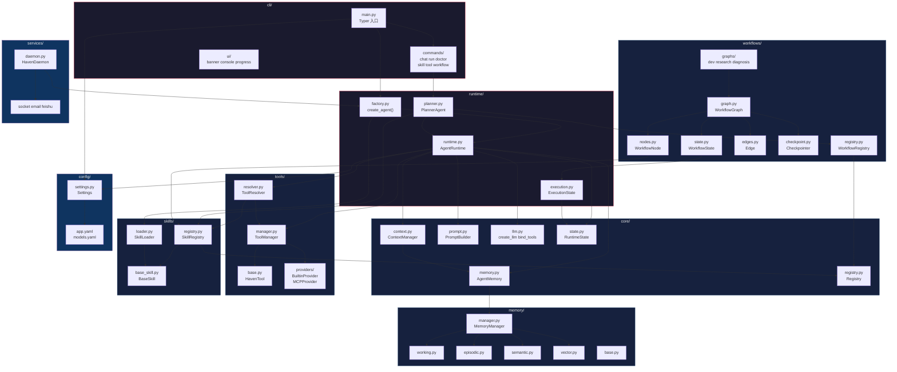
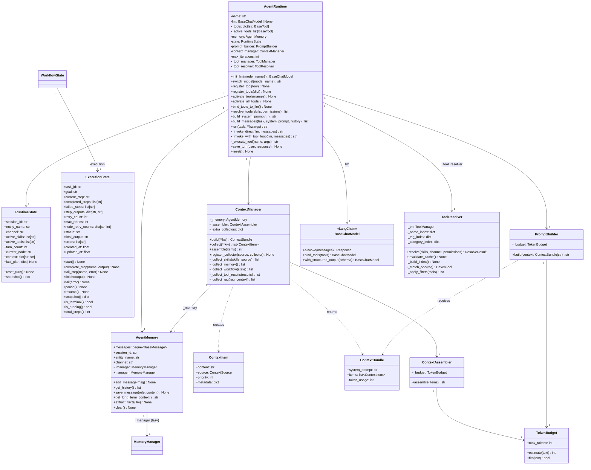
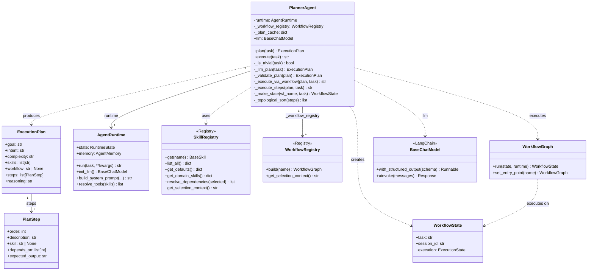
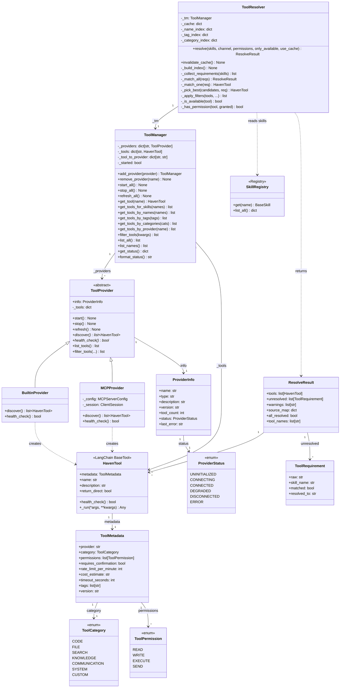
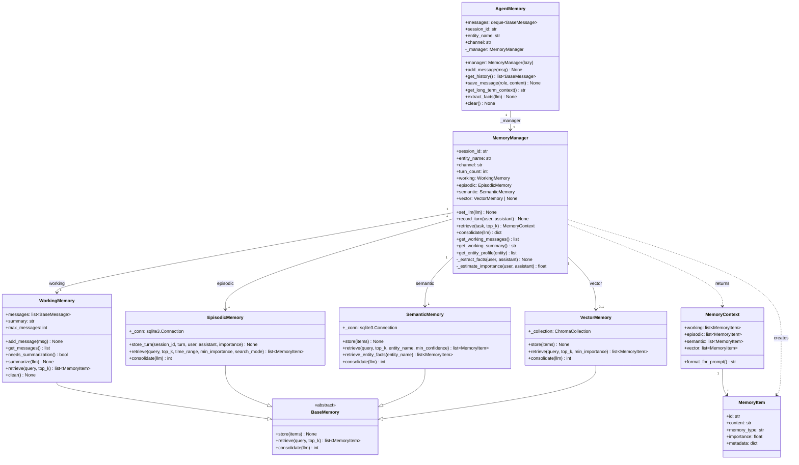
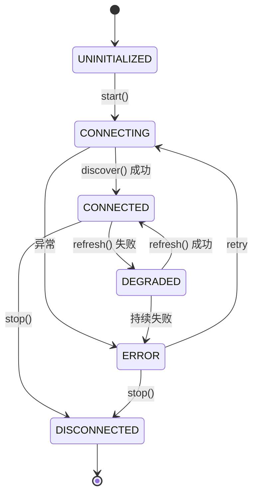
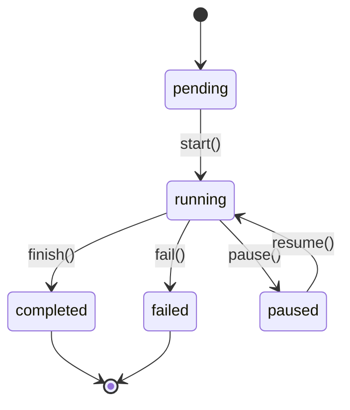
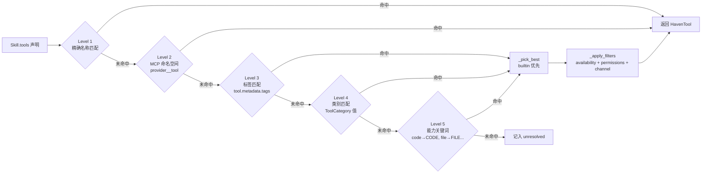

# Haven V2 UML 参考

> 自动生成于 2026-06-01

---

## 1. 包图



---

## 2. Runtime 类图



---

## 3. Planner 类图



---

## 4. Tool 类图



---

## 5. Memory 类图



---

## 6. Workflow 类图

```mermaid
classDiagram
    direction TB

    class WorkflowGraph {
        -_state_cls: type[WorkflowState]
        -_nodes: dict[str, Any]
        -_edges: dict[str, Edge|ConditionalEdge]
        -_entry_point: str
        -_checkpointer: Checkpointer
        -_max_iterations: int
        +END: str
        +add_node(name, node) WorkflowGraph
        +add_edge(source, target) WorkflowGraph
        +add_conditional_edge(source, router, route_map) WorkflowGraph
        +set_entry_point(name) WorkflowGraph
        +set_checkpointer(cp) WorkflowGraph
        +run(state, runtime, resume_from) WorkflowState
        -_apply_updates(state, updates) None
        -_final_output(state) str
    }

    class WorkflowState {
        +task: str
        +session_id: str
        +messages: list~BaseMessage~
        +current_node: str
        +node_outputs: dict[str, str]
        +node_retry_counts: dict[str, int]
        +max_retries_per_node: int
        +status: str
        +final_output: str
        +errors: list[str]
        +started_at: float
        +execution: ExecutionState
        -_runtime: AgentRuntime
    }

    class DevWorkflowState {
        +architecture_doc: str
        +source_code: str
        +code_language: str
        +review_feedback: str
        +review_score: float
        +review_blockers: list[str]
        +test_report: str
        +test_passed: bool
        +test_failures: list[str]
    }

    class ResearchWorkflowState {
        +research_topic: str
        +raw_findings: list[str]
        +analyzed_insights: str
        +final_report: str
        +sources: list[str]
    }

    class DiagnosisWorkflowState {
        +symptoms: str
        +collected_info: str
        +possible_causes: str
        +diagnosis: str
        +recommendations: str
    }

    class WorkflowNode {
        <<abstract>>
        +name: str
        +skill_name: str | None
        +max_retries: int
        +__call__(state) dict
        +_build_prompt(state)* str
        +_process_output(output, state) dict
        +_resolve_skills(state, names) list
        +_handle_error(state, exc) dict
    }

    class Edge {
        +source: str
        +target: str
    }

    class ConditionalEdge {
        +source: str
        +router: RouterFunc
        +route_map: dict
        +END: str
        +RETRY: str
        +resolve(state) str
    }

    class Checkpointer {
        <<abstract>>
        +save(session_id, node, state) None
        +load(session_id) dict
    }

    class SQLiteCheckpointer {
        -_conn: sqlite3.Connection
        +save(session_id, node, state) None
        +load(session_id) dict
    }

    class WorkflowRegistry {
        <<Registry>>
        +build(name) WorkflowGraph
        +get_selection_context() str
    }

    WorkflowGraph "1" --> "1" WorkflowState : _state_cls
    WorkflowGraph "1" --> "*" WorkflowNode : _nodes
    WorkflowGraph "1" --> "*" Edge : _edges
    WorkflowGraph "1" --> "0..1" Checkpointer : _checkpointer
    WorkflowState <|-- DevWorkflowState
    WorkflowState <|-- ResearchWorkflowState
    WorkflowState <|-- DiagnosisWorkflowState
    WorkflowState "1" --> "1" ExecutionState : execution
    WorkflowNode ..> WorkflowState : operates on
    WorkflowNode ..> SkillRegistry : _resolve_skills
    Edge <|-- ConditionalEdge
    Checkpointer <|-- SQLiteCheckpointer
    WorkflowRegistry ..> WorkflowGraph : builds

    %% 内置节点
    class PlannerNode {
        +name = "planner"
        +skill_name = "coder"
        +_build_prompt(state) str
    }
    class ArchitectNode {
        +name = "architect"
        +skill_name = "coder"
        +_build_prompt(state) str
        +_process_output(output, state) dict
    }
    class CoderNode {
        +name = "coder"
        +skill_name = "coder"
        +max_retries = 3
        +_build_prompt(state) str
        +_process_output(output, state) dict
    }
    class ReviewerNode {
        +name = "reviewer"
        +skill_name = "code_review"
        +_build_prompt(state) str
        +_process_output(output, state) dict
    }
    class TesterNode {
        +name = "tester"
        +skill_name = "coder"
        +_build_prompt(state) str
        +_process_output(output, state) dict
    }
    class SearcherNode {
        +name = "searcher"
        +skill_name = null
        +_build_prompt(state) str
    }
    class AnalystNode {
        +name = "analyst"
        +skill_name = "data_analysis"
        +_build_prompt(state) str
    }
    class SynthesizerNode {
        +name = "synthesizer"
        +skill_name = "summarization"
        +_build_prompt(state) str
    }
    class CollectorNode {
        +name = "collector"
        +skill_name = "medical"
        +_build_prompt(state) str
    }
    class AnalyzerNode {
        +name = "analyzer"
        +skill_name = "medical"
        +_build_prompt(state) str
    }
    class AdviserNode {
        +name = "adviser"
        +skill_name = "medical"
        +_build_prompt(state) str
    }

    WorkflowNode <|-- PlannerNode
    WorkflowNode <|-- ArchitectNode
    WorkflowNode <|-- CoderNode
    WorkflowNode <|-- ReviewerNode
    WorkflowNode <|-- TesterNode
    WorkflowNode <|-- SearcherNode
    WorkflowNode <|-- AnalystNode
    WorkflowNode <|-- SynthesizerNode
    WorkflowNode <|-- CollectorNode
    WorkflowNode <|-- AnalyzerNode
    WorkflowNode <|-- AdviserNode
```



---

## 7. 系统时序图

```mermaid
sequenceDiagram
    actor User
    participant CLI as CLI<br/>(main.py)
    participant Factory as Factory<br/>(create_agent)
    participant Planner as PlannerAgent
    participant Runtime as AgentRuntime
    participant CtxMgr as ContextManager
    participant Resolver as ToolResolver
    participant ToolMgr as ToolManager
    participant LLM as BaseChatModel<br/>(DeepSeek / OpenAI)
    participant Memory as AgentMemory<br/>→ MemoryManager
    participant WfGraph as WorkflowGraph

    Note over User,WfGraph: ── 初始化阶段 ──

    CLI->>Factory: create_agent(session_id, channel)
    Factory->>Runtime: AgentRuntime()
    Factory->>Memory: session_id / entity_name / channel
    Factory->>Factory: _load_all_skills(runtime) → SkillRegistry
    Factory->>Runtime: init_llm()
    Runtime->>LLM: create_llm(model_name)
    Factory->>ToolMgr: add_provider(BuiltinProvider)
    Factory->>ToolMgr: add_provider(MCPProvider(cfg))
    Factory->>ToolMgr: start_all()
    ToolMgr-->>Factory: tools synced
    Factory->>Runtime: _tool_resolver = ToolResolver(tm)
    Factory->>Runtime: bind_tools_to_llm()
    Factory->>Planner: PlannerAgent(runtime, workflow_registry)
    Factory-->>CLI: planner

    Note over User,WfGraph: ── 执行阶段 ──

    User->>CLI: task input
    CLI->>Planner: planner.execute(task)

    rect rgb(45, 55, 65)
        Note over Planner: Phase 1 — 规划
        Planner->>Planner: _is_trivial(task)?

        alt 非 trivial
            Planner->>LLM: with_structured_output(ExecutionPlan)
            LLM-->>Planner: ExecutionPlan {goal, intent, skills, steps, workflow}
            Planner->>Planner: SkillRegistry.resolve_dependencies(skills)
            Planner->>Planner: _validate_plan(plan)
        else trivial
            Planner->>Planner: fast-path ExecutionPlan
        end
    end

    alt Path 1: 简单对话
        Planner->>Runtime: runtime.run(task, use_memory=True)
        Runtime->>CtxMgr: build(personality_skills=[haven], use_memory=True)
        CtxMgr->>Memory: get_long_term_context()
        Memory-->>CtxMgr: formatted facts
        CtxMgr-->>Runtime: ContextBundle(system_prompt)
        Runtime->>Runtime: build_messages(task, system_prompt)
        Runtime->>LLM: ainvoke([SystemMessage, History, HumanMessage])
        LLM-->>Runtime: response
        Runtime-->>Planner: result
    else Path 2: 多步编排
        Planner->>Planner: _topological_sort(steps)
        loop each step
            Planner->>Resolver: resolve_tools([step.skill], channel)
            Resolver->>ToolMgr: get_tools_by_names/tags/categories
            ToolMgr-->>Resolver: HavenTool list
            Resolver-->>Planner: ResolveResult(tools)
            Planner->>Runtime: runtime.run(step_task, active_skills, tool_results)
            Runtime->>CtxMgr: build(personality, domain, tool_results)
            CtxMgr->>Memory: get_long_term_context()
            CtxMgr-->>Runtime: ContextBundle
            Runtime->>LLM: ainvoke(messages + tool loop)
            LLM-->>Runtime: response
            Runtime-->>Planner: step_output
        end
    else Path 3: 工作流
        Planner->>Planner: WorkflowRegistry.build(wf_name)
        Planner->>Planner: _make_state(wf_name, task)
        Planner->>WfGraph: graph.run(state, runtime)

        rect rgb(65, 45, 55)
            Note over WfGraph: DAG 执行循环
            loop while current != END
                WfGraph->>WfGraph: 获取 node
                WfGraph->>Runtime: node(state) → runtime.run(prompt, skills)
                Runtime->>CtxMgr: build(...)
                Runtime->>LLM: ainvoke()
                LLM-->>Runtime: response
                Runtime-->>WfGraph: output
                WfGraph->>WfGraph: _apply_updates(state, updates)
                WfGraph->>WfGraph: checkpoint.save(state) → SQLite
                WfGraph->>WfGraph: edge.resolve(state) → next_node
            end
        end

        WfGraph-->>Planner: final WorkflowState
    end

    Planner-->>CLI: response text
    CLI-->>User: display result
```



---

## 8. Agent 执行流程图

```mermaid
flowchart TD
    START([用户输入 task]) --> FACTORY[Factory.create_agent<br/>装配 Runtime + Skills + Tools + Planner]

    FACTORY --> INPUT{CLI 命令?}

    INPUT -->|chat| REPL[REPL 循环]
    INPUT -->|run| SINGLE[单任务]
    INPUT -->|serve| DAEMON[守护进程<br/>多通道监听]

    REPL --> PLAN
    SINGLE --> PLAN
    DAEMON --> PLAN

    PLAN[PlannerAgent.plan<br/>LLM Structured Output] --> TRIVIAL{_is_trivial?}

    TRIVIAL -->|Yes| FAST[快速路径<br/>intent=chat, skills=[]]
    TRIVIAL -->|No| LLM_PLAN[LLM 生成 ExecutionPlan<br/>goal + intent + skills + steps + workflow]

    LLM_PLAN --> VALIDATE[_validate_plan<br/>过滤无效 skill<br/>SkillRegistry.resolve_dependencies]

    FAST --> DISPATCH
    VALIDATE --> DISPATCH{分派路径}

    DISPATCH -->|steps=[]<br/>简单对话| PATH1[路径 1: Runtime 直通]
    DISPATCH -->|steps>0<br/>workflow=null| PATH2[路径 2: 多步编排]
    DISPATCH -->|workflow!=null| PATH3[路径 3: Workflow DAG]

    subgraph Runtime_Execution["AgentRuntime.run()"]
        direction TB

        BUILD_CTX[ContextManager.build<br/>收集 6 源上下文] --> ASSEMBLE[ContextAssembler.assemble<br/>按优先级 + token 预算裁剪]
        ASSEMBLE --> BUILD_MSG[build_messages<br/>SystemPrompt + History + HumanMessage]
        BUILD_MSG --> HAS_TOOLS{active_tools > 0?}

        HAS_TOOLS -->|No| DIRECT[_invoke_direct<br/>LLM.ainvoke → 直接返回]
        HAS_TOOLS -->|Yes| TOOL_LOOP[_invoke_with_tool_loop]

        subgraph Tool_Loop["工具调用循环 (≤ max_iterations)"]
            LLM_CALL[LLM.ainvoke] --> CHECK_TC{tool_calls?}
            CHECK_TC -->|No| RETURN[返回最终文本]
            CHECK_TC -->|Yes| EXEC_TOOLS[_execute_tool<br/>按名查找 + ainvoke]
            EXEC_TOOLS --> APPEND[追加 ToolMessage]
            APPEND --> INCR{iteration < max?}
            INCR -->|Yes| LLM_CALL
            INCR -->|No| RETURN
        end

        DIRECT --> SAVE[memory.record_turn]
        RETURN --> SAVE
    end

    PATH1 --> BUILD_CTX

    PATH2 --> SORT[_topological_sort<br/>按依赖拓扑排序]
    SORT --> STEP_LOOP{遍历每个 step}
    STEP_LOOP --> RESOLVE[ToolResolver.resolve<br/>5 级工具匹配]
    RESOLVE --> BUILD_CTX
    SAVE --> STEP_LOOP
    STEP_LOOP -->|完成| DONE

    PATH3 --> MAKE_STATE[_make_state<br/>DevWorkflowState / ResearchWorkflowState / ...]

    subgraph DAG_Engine["WorkflowGraph.run()"]
        direction TB
        WF_START[es.start()] --> WF_LOOP{current ≠ END?}

        WF_LOOP -->|Yes| GET_NODE[node = _nodes[current]]
        GET_NODE --> EXEC_NODE[node(state) → runtime.run()]
        EXEC_NODE --> APPLY[_apply_updates<br/>execution.* + state.*]
        APPLY --> CKPT[checkpoint.save<br/>state + execution_json]
        CKPT --> GET_EDGE[edge = _edges[current]]
        GET_EDGE --> EDGE_TYPE{edge type?}

        EDGE_TYPE -->|Edge| NEXT[target]
        EDGE_TYPE -->|ConditionalEdge| ROUTER[router(state)]

        ROUTER -->|RETRY| RETRY_CHECK{retries < max?}
        RETRY_CHECK -->|Yes| EXEC_NODE
        RETRY_CHECK -->|No| WF_FAIL[es.fail()]

        ROUTER -->|END| WF_END[es.finish()]
        ROUTER -->|node| NEXT

        NEXT --> WF_LOOP
        WF_LOOP -->|No| WF_END

        WF_FAIL --> WF_DONE[return state]
        WF_END --> WF_DONE
    end

    MAKE_STATE --> WF_START
    WF_DONE --> DONE

    DONE[最终结果] --> RESPONSE([返回用户])
```

---

## 附录: 关键状态机

### Provider 状态机



### ExecutionState 状态机



### ToolResolver 5 级匹配


